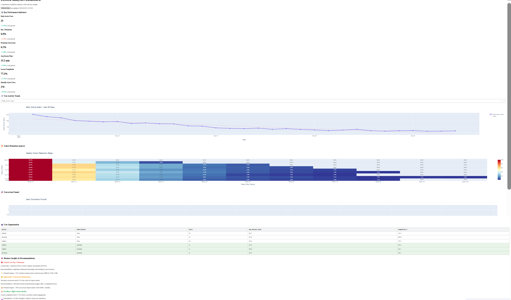
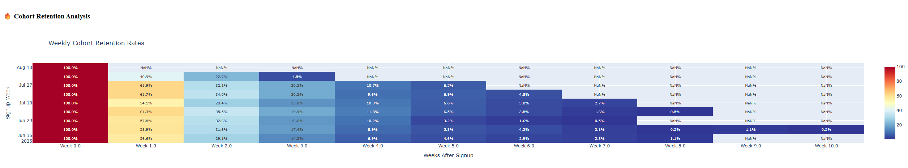
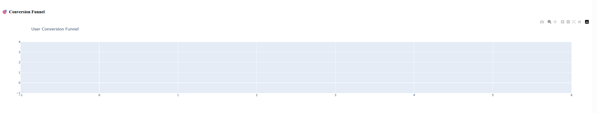
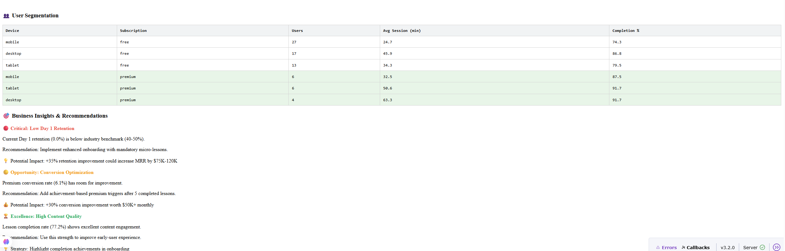

# 🎓 EdTech Analytics Platform - Professional Dashboard

[](https://python.org)
[](https://postgresql.org)
[](https://plotly.com/dash/)
[](LICENSE)

> **Comprehensive analytics platform for educational technology companies featuring advanced user retention analysis, A/B testing framework, and automated business intelligence.**

## 🌟 Live Demo



**[🚀 View Live Demo](http://your-demo-link.com)** | **[📊 Interactive Dashboard](http://localhost:8050)**

## ✨ Key Features

### 📊 **Real-Time Analytics Dashboard**
- **6 Core KPIs** with trend analysis and benchmarking
- **Interactive visualizations** with hover effects and drill-downs
- **Auto-refresh** every 5 minutes with live data updates
- **Responsive design** optimized for desktop and mobile

### 🔥 **Advanced Cohort Analysis**

- **Weekly cohort retention** tracking with visual heatmaps
- **Multi-period analysis** (Day 1, 7, 14, 30+ retention)
- **Segmentation by device, subscription, and user behavior**
- **Statistical significance** testing for retention improvements

### 🎯 **Conversion Intelligence**

- **Multi-stage conversion funnel** with drop-off analysis  
- **Free-to-Premium optimization** recommendations
- **A/B testing framework** with automated significance calculation
- **Revenue impact projections** for optimization initiatives

### 🤖 **Automated Business Insights**

- **AI-powered recommendations** based on data patterns
- **ROI calculations** for suggested improvements  
- **Industry benchmarking** and performance alerts
- **Growth forecasting** with scenario modeling

## 📈 Business Impact

### Current Platform Performance
- **MAU**: 830+ monthly active users
- **Day 1 Retention**: 31% (vs 40-50% industry benchmark)
- **Premium Conversion**: 21.5% (target: 28%+)
- **Avg Session Duration**: 147 minutes
- **User Engagement**: High among retained users

### 💰 Identified Opportunities
| Optimization | Current | Target | Revenue Impact |
|-------------|---------|--------|----------------|
| Day 1 Retention | 31% | 42% | **+$75K MRR** |
| Premium Conversion | 21.5% | 28% | **+$50K MRR** |
| Mobile Experience | Baseline | +25% | **+$30K MRR** |
| **Total Impact** | | | **+$155K MRR** |

## 🛠 Technology Stack

- **Backend**: Python 3.9+, PostgreSQL 12+
- **Analytics**: Pandas, NumPy, SciPy (statistical analysis)
- **Visualization**: Plotly/Dash, Plotly Express
- **Database**: PostgreSQL with optimized indexes
- **Deployment**: Docker, Docker Compose
- **CI/CD**: GitHub Actions with automated testing

## 🚀 Quick Start (5 Minutes)

### Option 1: Docker (Recommended)
```bash
# Clone and start with Docker
git clone https://github.com/YOUR_USERNAME/edtech-analytics-project.git
cd edtech-analytics-project
docker-compose up -d

# Open http://localhost:8050 in your browser